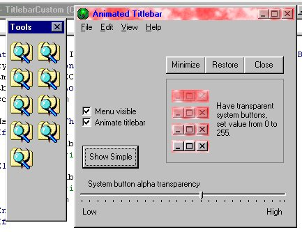



## Animated Titlebar take 3

### Description

More updates and more bugs fixed, please try this program. You can create great effects, ALPHA TRANSPARENCY on buttons gives a great effect. TAKE A LOOK AT SCREEN SHOT.
 
### More Info
 

             |
---                |---
**Submitted On**   |2000-08-02 19:48:40
**By**             |[Gary Eyles](https://github.com/Planet-Source-Code/PSCIndex/blob/master/ByAuthor/gary-eyles.md)
**Level**          |Advanced
**User Rating**    |4.8 (38 globes from 8 users)
**Compatibility**  |VB 6\.0
**Category**       |[Miscellaneous](https://github.com/Planet-Source-Code/PSCIndex/blob/master/ByCategory/miscellaneous__1-1.md)
**World**          |[Visual Basic](https://github.com/Planet-Source-Code/PSCIndex/blob/master/ByWorld/visual-basic.md)
**Archive File**   |[CODE\_UPLOAD8529822000\.zip](https://github.com/Planet-Source-Code/gary-eyles-animated-titlebar-take-3__1-10295/archive/master.zip)

